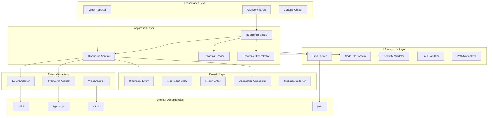
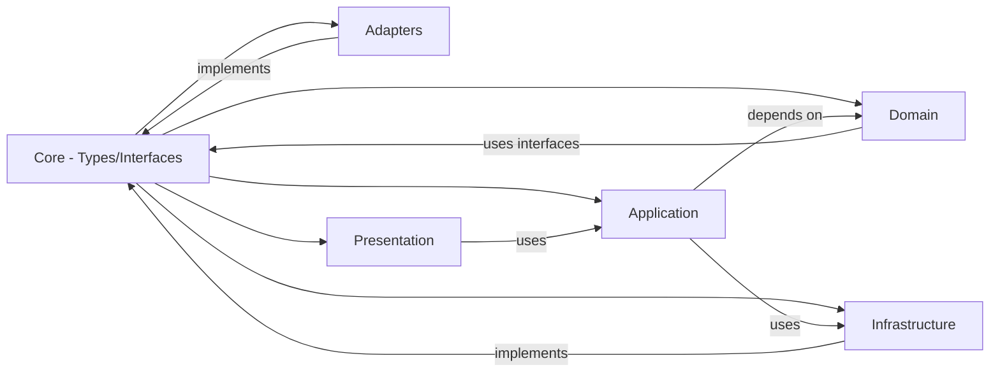
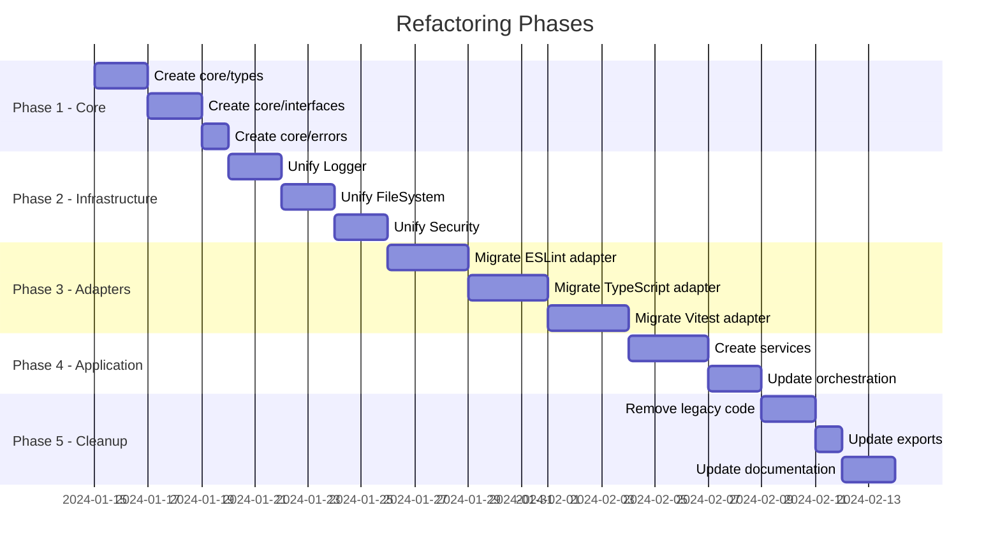

# OmnyReporter Architecture Refactoring Plan

## 1. Анализ текущей архитектуры

### 1.1 Обзор существующей структуры

```
src/
├── index.ts                    # Главная точка входа
├── VitestReporter.ts           # Vitest reporter (монолитный)
├── cli/                        # CLI команды
├── logger/                     # Собственный logger wrapper
├── reporters/                  # Диагностические репортеры
│   ├── eslint/                 # ESLint reporter
│   ├── typescript/             # TypeScript reporter
│   └── shared/                 # Общие утилиты
├── test-reporter/              # Legacy .mjs файлы
└── utils/                      # Вспомогательные утилиты
```

### 1.2 Выявленные проблемы текущей архитектуры

#### 🔴 Критические проблемы

1. **Дублирование кода Logger**
   - [`src/logger/Logger.ts`](src/logger/Logger.ts) - глобальный pino instance
   - [`src/reporters/shared/Logger.ts`](src/reporters/shared/Logger.ts:9) - `LoggerImpl` класс
   - Разные интерфейсы и способы использования

2. **Смешанные технологии файлов**
   - [`src/test-reporter/`](src/test-reporter/) содержит `.mjs` файлы с JSDoc типами
   - Остальная часть проекта на TypeScript
   - [`VitestExecutor.ts`](src/test-reporter/VitestExecutor.ts) дублируется с [`VitestExecutor.mjs`](src/test-reporter/VitestExecutor.mjs)

3. **Нечёткое разделение доменов**
   - Типы разбросаны по разным файлам: [`types.ts`](src/reporters/types.ts), [`interfaces.ts`](src/reporters/interfaces.ts), [`types.mjs`](src/test-reporter/types.mjs)
   - Нет чёткой границы между доменными сущностями и инфраструктурой

4. **Дублирование функционала**
   - [`FileSystemManager`](src/utils/FileSystemManager.ts) и [`DirectoryManager`](src/reporters/shared/DirectoryManager.ts) - похожая функциональность
   - [`PathNormalizer`](src/reporters/shared/PathNormalizer.ts) и [`src/test-reporter/PathNormalizer.mjs`](src/test-reporter/PathNormalizer.mjs)
   - [`SecurityValidator`](src/reporters/shared/SecurityValidator.ts:81) `sanitizeMessage` и [`SensitiveDataSanitizer`](src/utils/SensitiveDataSanitizer.ts)

#### 🟡 Архитектурные недостатки

1. **Жёсткая связанность компонентов**
   - Factories создают зависимости напрямую: [`EslintReporterFactory`](src/reporters/eslint/EslintReporterFactory.ts:21)
   - Нет Dependency Injection контейнера

2. **Монолитный VitestReporter**
   - [`VitestReporter.ts`](src/VitestReporter.ts) содержит 330 строк
   - Смешивает UI-логику, статистику, файловые операции

3. **Отсутствие абстракций для внешних зависимостей**
   - Прямое использование `pino`, `eslint`, `typescript`
   - Затрудняет тестирование и замену реализаций

4. **Неоднородность паттернов**
   - Factory как объект: `EslintReporterFactory = { create, createWithDependencies }`
   - Factory как класс в других местах

---

## 2. Предлагаемая новая архитектура

### 2.1 Доменная структура (Domain-Driven Design Lite)

```
src/
├── core/                           # Ядро системы
│   ├── types/                      # Все типы и интерфейсы
│   │   ├── diagnostic.ts           # Diagnostic, DiagnosticsSummary
│   │   ├── test-result.ts          # TestResult, TestFailure
│   │   ├── config.ts               # Все конфигурации
│   │   └── index.ts                # Barrel export
│   ├── interfaces/                 # Контракты/порты
│   │   ├── logger.ts               # ILogger
│   │   ├── file-system.ts          # IFileSystem, IDirectoryManager
│   │   ├── path-normalizer.ts      # IPathNormalizer
│   │   ├── security.ts             # ISecurityValidator, ISanitizer
│   │   ├── diagnostic-source.ts    # IDiagnosticSource
│   │   ├── report-writer.ts        # IReportWriter
│   │   └── index.ts
│   └── errors/                     # Доменные ошибки
│       ├── diagnostic-error.ts
│       ├── validation-error.ts
│       └── index.ts
│
├── domain/                         # Доменная логика
│   ├── diagnostics/                # Diagnostic aggregate
│   │   ├── diagnostic.entity.ts    # Immutable Diagnostic
│   │   ├── diagnostic.aggregator.ts
│   │   ├── diagnostic.validator.ts
│   │   └── index.ts
│   ├── test-results/               # Test results aggregate
│   │   ├── test-result.entity.ts
│   │   ├── statistics.collector.ts
│   │   └── index.ts
│   └── reporting/                  # Reporting domain
│       ├── report.entity.ts
│       ├── report.builder.ts
│       └── index.ts
│
├── infrastructure/                 # Внешние адаптеры
│   ├── logging/                    # Logging implementations
│   │   ├── pino-logger.ts
│   │   ├── console-logger.ts
│   │   └── index.ts
│   ├── file-system/                # File system operations
│   │   ├── node-file-system.ts
│   │   ├── directory-manager.ts
│   │   └── index.ts
│   ├── security/                   # Security implementations
│   │   ├── path-validator.ts
│   │   ├── data-sanitizer.ts
│   │   └── index.ts
│   ├── path/                       # Path utilities
│   │   ├── path-normalizer.ts
│   │   └── index.ts
│   └── serialization/              # JSON/output serialization
│       ├── json-serializer.ts
│       └── index.ts
│
├── adapters/                       # External tool adapters
│   ├── eslint/                     # ESLint adapter
│   │   ├── eslint.adapter.ts       # Implements IDiagnosticSource
│   │   ├── eslint.parser.ts
│   │   ├── eslint.config.ts
│   │   └── index.ts
│   ├── typescript/                 # TypeScript adapter
│   │   ├── typescript.adapter.ts
│   │   ├── typescript.parser.ts
│   │   ├── typescript.config.ts
│   │   └── index.ts
│   └── vitest/                     # Vitest adapter
│       ├── vitest.reporter.ts
│       ├── vitest.executor.ts
│       ├── vitest.parser.ts
│       └── index.ts
│
├── application/                    # Application services
│   ├── services/                   # Use cases
│   │   ├── diagnostic.service.ts   # Run diagnostics
│   │   ├── reporting.service.ts    # Generate reports
│   │   ├── test.service.ts         # Run tests
│   │   └── index.ts
│   ├── orchestration/              # Orchestrators
│   │   ├── reporting.orchestrator.ts
│   │   └── index.ts
│   └── facades/                    # Simplified APIs
│       ├── reporting.facade.ts
│       └── index.ts
│
├── presentation/                   # UI/CLI layer
│   ├── cli/                        # CLI commands
│   │   ├── commands/
│   │   │   ├── diagnostics.command.ts
│   │   │   ├── report.command.ts
│   │   │   └── index.ts
│   │   ├── formatters/
│   │   │   ├── console.formatter.ts
│   │   │   └── index.ts
│   │   └── index.ts
│   └── reporters/                  # Output reporters
│       ├── console.reporter.ts
│       ├── json.reporter.ts
│       └── index.ts
│
├── di/                             # Dependency Injection
│   ├── container.ts                # IoC container
│   ├── tokens.ts                   # DI tokens
│   └── index.ts
│
└── index.ts                        # Main entry point
```

### 2.2 Архитектурная диаграмма



### 2.3 Граф зависимостей между слоями



---

## 3. Детали рефакторинга по компонентам

### 3.1 Core Layer - Типы и интерфейсы

#### Консолидация типов

**До:**
```typescript
// src/reporters/types.ts
export interface Diagnostic { ... }

// src/reporters/interfaces.ts  
export interface DiagnosticSource { ... }

// src/test-reporter/types.mjs
/** @typedef {Object} VitestTestResult */
```

**После:**
```typescript
// src/core/types/diagnostic.ts
export interface Diagnostic {
  readonly id: string;  // Добавить уникальный идентификатор
  readonly filePath: string;
  readonly line: number;
  readonly column: number;
  readonly severity: DiagnosticSeverity;
  readonly ruleId?: string;
  readonly message: string;
  readonly suggestion?: string;
  readonly source: DiagnosticSource;
  readonly timestamp: Date;
}

export type DiagnosticSeverity = 'error' | 'warning' | 'info';
export type DiagnosticSource = 'eslint' | 'typescript' | 'vitest';

// src/core/interfaces/diagnostic-source.ts
export interface IDiagnosticSource {
  readonly name: DiagnosticSource;
  collect(config: CollectorConfig): Promise<DiagnosticsResult>;
  validate(): Promise<ValidationResult>;
}
```

### 3.2 Logger унификация

**До:**
- Два разных логгера с разными интерфейсами
- Глобальный instance

**После:**
```typescript
// src/core/interfaces/logger.ts
export interface ILogger {
  info(message: string, context?: Record<string, unknown>): void;
  warn(message: string, context?: Record<string, unknown>): void;
  error(message: string, context?: Record<string, unknown>): void;
  debug(message: string, context?: Record<string, unknown>): void;
  child(bindings: Record<string, unknown>): ILogger;
}

// src/infrastructure/logging/pino-logger.ts
export class PinoLogger implements ILogger {
  constructor(
    private readonly logger: pino.Logger,
    private readonly config: LoggerConfig
  ) {}
  // ...implementation
}
```

### 3.3 File System абстракция

**До:**
- `FileSystemManager` - для тестов
- `DirectoryManager` - для диагностик
- Прямые вызовы `fs`

**После:**
```typescript
// src/core/interfaces/file-system.ts
export interface IFileSystem {
  readFile(path: string): Promise<string>;
  writeFile(path: string, content: string): Promise<void>;
  exists(path: string): Promise<boolean>;
  mkdir(path: string, options?: MkdirOptions): Promise<void>;
  rm(path: string, options?: RmOptions): Promise<void>;
  stat(path: string): Promise<FileStats>;
}

export interface IDirectoryManager {
  getOutputDir(type: ReportType): string;
  ensureDirectory(path: string): Promise<void>;
  cleanDirectory(path: string): Promise<void>;
}

// src/infrastructure/file-system/node-file-system.ts
export class NodeFileSystem implements IFileSystem {
  // Единая реализация через node:fs/promises
}
```

### 3.4 Security и Sanitization

**До:**
- `SecurityValidator.sanitizeMessage()` - regex-based
- `SensitiveDataSanitizer` - pino redact

**После:**
```typescript
// src/core/interfaces/security.ts
export interface ISanitizer {
  sanitize(data: unknown): unknown;
  sanitizeMessage(message: string): string;
}

export interface IPathValidator {
  isPathSafe(path: string): boolean;
  isWithinBoundary(path: string, boundary: string): boolean;
}

// Использовать только @pinojs/redact как основу
// src/infrastructure/security/data-sanitizer.ts
export class DataSanitizer implements ISanitizer {
  constructor(private readonly redactor: ReturnType<typeof redact>) {}
}
```

### 3.5 Dependency Injection

**Предложение:** использовать [TSyringe](https://github.com/microsoft/tsyringe) или простую реализацию:

```typescript
// src/di/container.ts
import { container } from 'tsyringe';

// Регистрация зависимостей
container.registerSingleton<ILogger>('Logger', PinoLogger);
container.registerSingleton<IFileSystem>('FileSystem', NodeFileSystem);
container.registerTransient<IDiagnosticSource>('ESLintSource', ESLintAdapter);

// Использование
@injectable()
export class DiagnosticService {
  constructor(
    @inject('Logger') private readonly logger: ILogger,
    @inject('ESLintSource') private readonly eslintSource: IDiagnosticSource
  ) {}
}
```

---

## 4. Замена на готовые решения

### 4.1 Рекомендуемые библиотеки

| Текущий код | Замена | Обоснование |
|-------------|--------|-------------|
| `PathNormalizerImpl` | [upath](https://www.npmjs.com/package/upath) | Кросс-платформенная нормализация, 2M+ weekly downloads |
| Custom timeout | [p-timeout](https://www.npmjs.com/package/p-timeout) | Battle-tested, TypeScript, edge cases handled |
| Custom retry | [p-retry](https://www.npmjs.com/package/p-retry) | Exponential backoff, TypeScript |
| Stream processing | [highland](https://www.npmjs.com/package/highland) или native async iterators | Более идиоматичный подход |
| Batch processing | [p-map](https://www.npmjs.com/package/p-map) | Concurrency control |
| Schema validation | [zod](https://www.npmjs.com/package/zod) | Runtime validation, TypeScript-first |
| Result type | [neverthrow](https://www.npmjs.com/package/neverthrow) | Type-safe error handling |

### 4.2 Детальные замены

#### 4.2.1 Path Normalization

```bash
npm install upath
```

```typescript
// До
class PathNormalizerImpl {
  normalize(rawPath: string): string { ... }
}

// После
import upath from 'upath';

export const normalizePath = (rawPath: string, baseDir?: string): string => {
  const normalized = upath.normalizeSafe(rawPath);
  if (baseDir && upath.isAbsolute(rawPath)) {
    return upath.relative(baseDir, normalized);
  }
  return normalized;
};
```

#### 4.2.2 Timeout handling

```bash
npm install p-timeout
```

```typescript
// До
protected async withTimeout<T>(operation: Promise<T>, timeoutMs: number): Promise<T> {
  return Promise.race([operation, this.createTimeout(timeoutMs)]);
}

// После
import pTimeout from 'p-timeout';

const result = await pTimeout(operation, {
  milliseconds: timeoutMs,
  message: `Operation timed out after ${timeoutMs}ms`
});
```

#### 4.2.3 Configuration Validation с Zod

```bash
npm install zod
```

```typescript
import { z } from 'zod';

export const CollectorConfigSchema = z.object({
  cwd: z.string().min(1),
  maxBuffer: z.number().positive().default(10 * 1024 * 1024),
  timeout: z.number().positive().default(30000),
  securityPolicy: z.enum(['strict', 'moderate']).default('strict'),
  outputDir: z.string().optional(),
  sanitize: z.boolean().default(true),
  patterns: z.array(z.string()).optional(),
});

export type CollectorConfig = z.infer<typeof CollectorConfigSchema>;

// Использование
const config = CollectorConfigSchema.parse(rawConfig);
```

#### 4.2.4 Result Type для Error Handling

```bash
npm install neverthrow
```

```typescript
import { Result, ok, err } from 'neverthrow';

export class DiagnosticService {
  async collect(config: CollectorConfig): Promise<Result<DiagnosticsResult, DiagnosticError>> {
    try {
      const result = await this.source.collect(config);
      return ok(result);
    } catch (error) {
      return err(new DiagnosticError('Collection failed', { cause: error }));
    }
  }
}

// Использование
const result = await service.collect(config);
result.match(
  (data) => console.log('Success:', data),
  (error) => console.error('Failed:', error)
);
```

---

## 5. План миграции

### 5.1 Фазы рефакторинга



### 5.2 Порядок рефакторинга (детальный)

#### Phase 1: Core Foundation
1. Создать `src/core/types/` со всеми типами
2. Создать `src/core/interfaces/` с контрактами
3. Создать `src/core/errors/` с доменными ошибками
4. Обновить экспорты в `src/index.ts`

#### Phase 2: Infrastructure Consolidation
1. Создать единый `ILogger` и `PinoLogger`
2. Создать `IFileSystem` и `NodeFileSystem`
3. Объединить `ISanitizer` (использовать @pinojs/redact)
4. Создать `IPathNormalizer` (на базе upath)
5. Добавить DI контейнер

#### Phase 3: Adapter Migration
1. Переписать `ESLintAdapter` с новыми интерфейсами
2. Переписать `TypeScriptAdapter`
3. Переписать `VitestAdapter` (из VitestReporter.ts)
4. Удалить legacy `.mjs` файлы

#### Phase 4: Application Layer
1. Создать `DiagnosticService`
2. Создать `ReportingService`
3. Обновить `ReportingOrchestrator`
4. Обновить `ReportingFacade`

#### Phase 5: Cleanup & Documentation
1. Удалить дублирующийся код
2. Обновить public API exports
3. Обновить README.md
4. Добавить примеры использования

---

## 6. Преимущества новой архитектуры

### 6.1 Для разработки

| Аспект | До | После |
|--------|-----|-------|
| Добавление нового reporter | Копировать существующий, модифицировать | Реализовать `IDiagnosticSource`, зарегистрировать в DI |
| Тестирование | Сложно мокать зависимости | Inject mock через DI |
| Замена логгера | Изменения везде | Заменить одну реализацию |

### 6.2 Для тестирования

```typescript
// Легко создать тестовый контейнер
const testContainer = createTestContainer({
  Logger: MockLogger,
  FileSystem: InMemoryFileSystem,
  ESLintSource: MockESLintSource,
});

const service = testContainer.resolve(DiagnosticService);
```

### 6.3 Для расширения

```typescript
// Добавить новый источник диагностик (например, Biome)
@injectable()
export class BiomeAdapter implements IDiagnosticSource {
  readonly name = 'biome' as DiagnosticSource;
  
  async collect(config: CollectorConfig): Promise<DiagnosticsResult> {
    // Implementation
  }
}

// Зарегистрировать
container.register('BiomeSource', BiomeAdapter);
```

---

## 7. Вопросы для обсуждения

1. **DI Container**: Использовать TSyringe, InversifyJS, или простую ручную реализацию?

2. **Миграция `.mjs` файлов**: Конвертировать в TypeScript или удалить (функционал дублируется)?

3. **Breaking Changes**: Допустимо ли изменение public API (exports)?

4. **Монорепо**: Рассматривать ли разделение на пакеты (`@omnygroup/core`, `@omnygroup/eslint-reporter`)?

5. **Библиотеки**: Какие из предложенных библиотек одобрены для использования?

---

## 8. Следующие шаги

После утверждения плана:

1. [ ] Создать branch `refactor/architecture`
2. [ ] Начать с Phase 1 - Core Foundation
3. [ ] Написать unit-тесты для новых интерфейсов
4. [ ] Постепенная миграция с сохранением обратной совместимости
5. [ ] Code review после каждой фазы

---

*Создано: 2026-01-14*
*Автор: Architect Mode*
